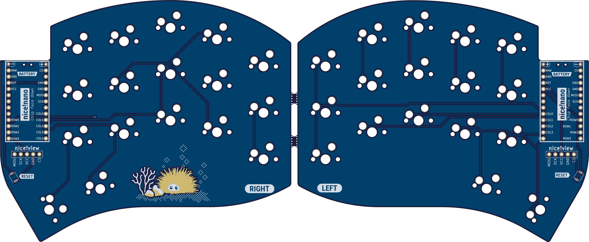

# Ursa - Urchin on Steroids

  
  
  

I created this design because I like the [Urchin](https://github.com/duckyb/urchin) and wanted to try something with 34 keys.  
**This is a strictly wireless-only design, and is only compatible with ZMK / nice!nano. Only Cherry MX switches + Hotswap are suported!**

> Q: Why is this not just another one?  
*A: Original Urchin is based of choc switch. They are good but I still wanted to try something with MX keycaps. Hence we are here looking at the new keeyboard Ursa.*

**If you enjoy my work, please consider ⭐ starring and/or ❤ sponsoring it.**

## Features
- [x] Design fully optimized for wireless    
- [x] Native nice!view support  
- [x] Familiar Ferris/Sweep/Urchin layout  
- [x] Improved outline shape  
- [x] Support for Cherry MX Socket
- [x] Remove diode footprint from the top surface

### Upcoming
- [ ] Mounting points for cases
- [ ] Plate file
- [ ] MCU Cover file
- [ ] Tray case 3D model

## Part list (for both sides)
#### Required
- 1× PCB Kit (files for it are in [releases](https://github.com/duckyb/urchin/releases))
- 34× Kailh **MX** Hotswap Sockets
- 34× MX Compatible switches
- 34× Keycaps
- 34× SMD diodes (SOD-123)
- 2× nice!nano
- 2× Lipo battery (301230)
- 48× mill-max machined pins
- 2× Pair of female headers
#### Optional
- 2× nice!view
- 2× Reset switch (B3U-1000P(M))
- 2× Power switch (MSK 12C02)
- 10× adhesive silicone feet

## Reference build guide:

## Firmware
Coming soon but for now you can refere to below,

> Urchin supports ZMK only. To get started with ZMK visit the [zmk-urchin repository](https://github.com/duckyb/zmk-urchin) and follow the provided instructions.

## Credits
- Urchin by [duckyb](https://github.com/duckyb/urchin)
